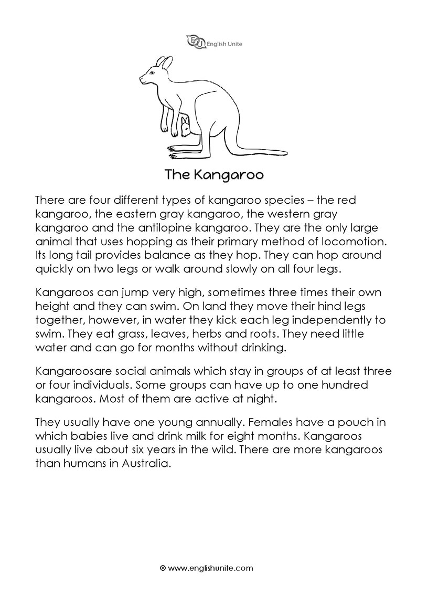
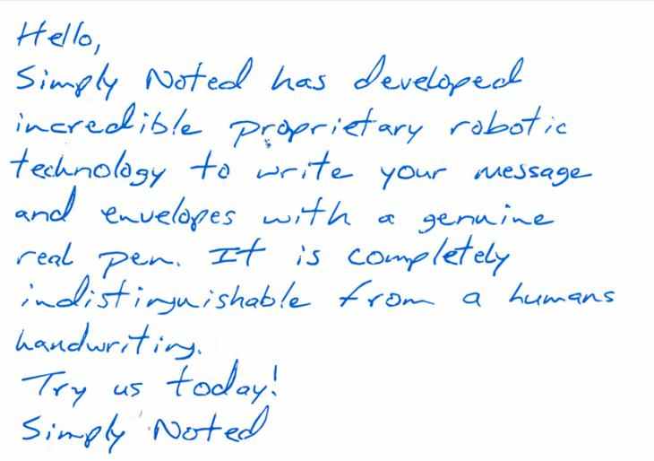

# Project Report: Image to Text Converter

**Project Title:** Image to Text Converter  
**Project Author:** sonu gupta
**Date:** 30 March 2024

---

## 1. Introduction

The "Image to Text Converter" project aims to develop a Python program that can extract text from images using Optical Character Recognition (OCR) techniques. This report provides an overview of the project objectives, functionality, implementation details, and future enhancements.

---

## 2. Project Overview

The project utilizes Python libraries such as PIL (Python Imaging Library) and pytesseract to process images and perform text extraction. The primary functionality includes loading images from URLs or local file paths, applying OCR to extract text, and displaying the extracted text.

---

## 3. Functionality

The key functionalities of the project include:

- Loading images from URLs or local file paths.
- Utilizing pytesseract to perform OCR and extract text from images.
- Displaying the extracted text to the console.

---

## 4. Libraries and Dependencies

The project relies on the following Python libraries:

- **PIL (Python Imaging Library)**: For image processing tasks.
- **pytesseract**: A Python wrapper for Tesseract-OCR Engine.
- **requests**: For making HTTP requests to download images.
- **io**: For working with streams and binary data.

Dependencies:
- Tesseract-OCR Engine: Required for performing OCR on images.

---

## 5. Project Structure

The project consists of a single Python script (`img2text.ipynb`) containing the following components:

- Functions for loading images from URLs or local file paths.
- Function for extracting text from images using OCR.
- Iteration over a list of image URLs for processing multiple images.
- Sample image URLs stored in the `links` list for testing.

---

## 6. Code 

- Connecting to drive
```
import io
from google.colab import drive
drive.mount("/content/drive/")
```

- Implement a function to extract text from an image.
``` 
from PIL import Image
import pytesseract
import requests
from io import BytesIO

def load_image(image_url):
    if image_url.startswith("https://"):
        # Download the image from the URL
        response = requests.get(image_url)
        img = Image.open(BytesIO(response.content))
    else:
        # Assuming image_url is a local file path
        img = Image.open(image_url)
    return img

def extract_text_from_image_url(image_url):
    img = load_image(image_url)
    # Configure pytesseract to use the Google Colab Tesseract installation path
    pytesseract.pytesseract.tesseract_cmd = r'/usr/bin/tesseract'
    # Extract text from the image
    text = pytesseract.image_to_string(img)
    print(text)
```

- Iterate over the links and call the extract_text_from_image_url function for each link
```
# List of links
links = [
    "/content/drive/MyDrive/TextImg/sample.png",
    "/content/drive/MyDrive/TextImg/kangaroo-reading.jpg",
    "https://replicate.delivery/pbxt/Jj87qg6dTft3R5kFIzda2vorF3epnzwJpv96PsKcgkdZipLV/figure-65.png",
    "https://i0.wp.com/reliancevitamin.com/wp-content/uploads/2021/02/Reliance-Vitamin-PreWorkout-SFP.png?resize=534%2C607&ssl=1"
]

for link in links:
    print("\nOUTPUT: "+link+" \n")
    extract_text_from_image_url(link)
```
---

## 7. Test Cases

The project includes the following test cases to verify the functionality:

1. Test Case 1: Local file path to a sample image.
2. Test Case 2: URL to an image with complex content.
3. Test Case 3: URL to an image with poor quality.
4. Test Case 4: URL to a non-text image.
5. Test Case 5: URL to an image with handwritten text.

---

## 8. Input and Output

- **Input:** Image URLs stored in a list (`links`).

- **img 1 (local storage)**



- **img 2 (public url)**


- **img 3 (Handwritten image)**



- **Output:** Extracted text from each image, printed to the console.

- sample output of img 1

```
OUTPUT: /content/drive/MyDrive/TextImg/kangaroo-reading.jpg 

 

The Kangaroo

There are four different types of kangaroo species — the red
kangaroo, the eastern gray kangaroo, the western gray
kangaroo and the antilopine kangaroo. They are the only large
animal that uses hopping as their primary method of locomotion.
Its long tail provides balance as they hop. They can hop around
quickly on two legs or walk around slowly on all four legs.

Kangaroos can jump very high, sometimes three times their own
height and they can swim. On land they move their hind legs
together, however, in water they kick each leg independently to
swim. They eat grass, leaves, herbs and roots. They need little
water and can go for months without drinking.

Kangaroosare social animals which stay in groups of at least three
or four individuals. Some groups can have up to one hundred
kangaroos. Most of them are active at night.

They usually have one young annually. Females have a pouch in
which babies live and drink milk for eight months. Kangaroos
usually live about six years in the wild. There are more kangaroos
than humans in Australia.

© wwwenglishunite.com
```
- sample output of img 2

```
OUTPUT: https://replicate.delivery/pbxt/Jj87qg6dTft3R5kFIzda2vorF3epnzwJpv96PsKcgkdZipLV/figure-65.png 

It was the best of
times, it was the worst
of times, it was the age
of wisdom, it was the
age of foolishness...
```
- sample output of img 1

```
OUTPUT: /content/drive/MyDrive/TextImg/sample-handwritten-2.png 

Hello,

Simply Natect has Sevelapect
iperesl re fe PRroypcitary robot se
Technolgy te Bete. your message
a enveloyes er ee genni ne
real Pen. zr a Comp (ef ely

swab stirgntthable. Kittin & temcane
ken aot wy.

Tey us today!

Singh “Note!
```

---

## 9. Challenges Faced

- Compatibility and installation issues with Tesseract-OCR Engine.
- Handling different types of images with varying quality and languages.
- Dealing with network-related errors during image download.

---

## 10. Solutions Implemented

- Clear instructions provided for installing and configuring Tesseract-OCR Engine.
- Techniques such as image preprocessing and adjusting OCR parameters implemented to improve accuracy.
- Error handling mechanisms added to handle network-related errors.

---

## 11. Performance Evaluation

- Metrics such as accuracy, processing time, and resource usage evaluated for text extraction process.
- Testing conducted with diverse image datasets to assess robustness and reliability.

---

## 12. Future Enhancements

- Integration with machine learning models for advanced preprocessing and recognition techniques.
- Support for additional image formats and sources.
- Implementation of a user-friendly interface for enhanced usability.

---

## 13. Conclusion

The "Image to Text Converter" project demonstrates the effectiveness of OCR techniques in extracting text from images. With further enhancements and optimizations, the project has the potential to serve as a valuable tool for various applications, contributing to increased productivity and efficiency.

---

## 14. References


- PIL (Python Imaging Library)
   - Official documentation: [PIL Documentation](https://pillow.readthedocs.io/en/stable/)
   - Tutorial on using PIL for image processing: [PIL Tutorial](https://www.geeksforgeeks.org/python-pillow-image-module/)

- pytesseract
   - GitHub repository: [pytesseract GitHub](https://github.com/madmaze/pytesseract)
   - Official documentation: [pytesseract Documentation](https://pypi.org/project/pytesseract/)
   - Tutorial on using pytesseract for OCR: [pytesseract Tutorial](https://nanonets.com/blog/ocr-with-tesseract/)

- requests
   - Official documentation: [requests Documentation](https://docs.python-requests.org/en/latest/)
   - Tutorial on making HTTP requests with requests library: [requests Tutorial](https://realpython.com/python-requests/)

- io:
   - Official documentation: [io Documentation](https://docs.python.org/3/library/io.html)
   - Tutorial on working with streams and binary data using io module: [io Tutorial](https://www.tutorialspoint.com/python3/python_io.htm)

- Tesseract-OCR Engine
   - GitHub repository: [Tesseract-OCR GitHub](https://github.com/tesseract-ocr/tesseract)
   - Official documentation: [Tesseract Documentation](https://tesseract-ocr.github.io/tessdoc/)
   - Installation guide for Tesseract-OCR: [Tesseract Installation](https://github.com/tesseract-ocr/tesseract/wiki#installation)


---
